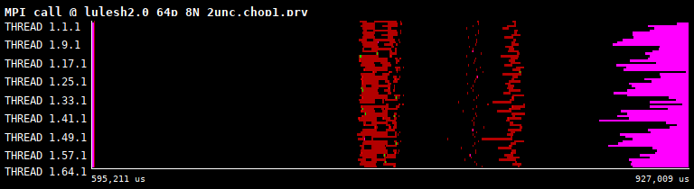

## Contact
**General support**: paraver@bsc.es

## Use Cases

### 1. Browse performance data in Paraver traces
* *Input:* A Paraver trace (see [Tracefile Description](https://tools.bsc.es/doc/1370.pdf) manual)
* *Output:* Timeline, profile and histogram views that can be configured to display any metric available in the trace 

### 2. Run external tools to analyze selected intervals of the trace
* *Input*: Same as [case 1](#1-Browse-performance-data-in-Paraver-traces)
* *Output*: Tool's reports that may include a new Paraver trace with enriched information (e.g. including new memory metrics from PROFET analysis) 
* *Limits*: 
    * A working installation of the external tool needs to be accessible in PATH.

## Installation
### EasyBuild
```
eb --software=Paraver,4.11.2
```
### Spack
```
spack install wxparaver@4.11.2
```

### From pre-built binaries
Paraver is offered as precompiled, ready to use, binaries, available to download from https://tools.bsc.es/downloads for GNU/Linux, macOS and Windows. After downloading the desired version, the installation only requires unpacking the compressed archive into the desired location.

In all cases, run ```wxparaver``` located under ```<paraver_root_dir>/bin``` to start the program.

## Getting Started
### Tutorials
Online tutorials are included in Paraver showing the basic navigation controls and interface buttons, and providing an interactive guide of analysis of real applications. To access the tutorials, go to the tool's menu "Help ⟶ Tutorials", and they can be automatically installed by clicking on the "Download and install tutorials" button:

|  |  |
| -------- | -------- | 

### Loading traces and views 

To load an applications's tracefile, go to "File ⟶ Load trace...", and browse to the location with the file with *prv* extension. Paraver automatically suggests interesting views through the Hints menu depending on the contents of the tracefile. Use this Hints for a quick view of the application’s performance. Further views are available under the "File ⟶ Load configuration...! menu.

|  | 
| -------- | -------- | 
| Paraver's File Menu | Paraver's Hints Menu |

Paraver shows the performance information using timelines and tables, where the y-axes represent a computing resource (processes, threads or accelerators). In timelines, x-axes represent the application’s activity over time. 


| Paraver timeline views  |
| - |
|  |
| MPI calls | 
|  |
| Duration of computing bursts | 

Tables are presented in the form of profiles and histograms, depending on whether the metric is discrete, e.g., MPI calls, or continuous, e.g., duration of computing bursts, and their x-axes represent a value, or a range of values for the given metric, respectively.

|  |  |
| - | - |
| Profile of MPI calls  | Histogram computing bursts' duration |

### Running PROFET analysis 

A working installation of PROFET is required to run this analysis, and ensure that the executable ```profet``` is in the environment variable ```PATH```.
With a trace already loaded containing uncore memory counters data ([see Extrae's guide](https://github.com/bsc-performance-tools/extrae/tree/devel/README-DEEP.md#Obtaining-traces-with-optional-data-for-PROFET)), and a timeline view optionally zoomed on any particular interval of interest, the user needs to:

1. Right click on the timeline to open the context menu, select ```Run ⟶ PROFET```: 

|  |  |
| - | - |
| Run ⟶ PROFET option in Paraver's context menu | New Paraver's dialog to configure, run and view the output of PROFET | 
2. In the new PROFET dialog, configure the settings by selecting the architecture configuration file (Config file). Configuration files for several architectures are distributed with PROFET source code, under the folder "configs". Additionally, select whether the memory metrics should be reported at the level of memory controller, or aggregated by socket (default).

> Example of PROFET config file tuned for DEEP system  
 ```
 {
    "memory_system" : "ddr4_2666",
    "cpu_freq_ghz" : 3.2,
    "cache_line_bytes" : 64
 } 
 ``` 

3. Click on "Run" to start the analysis, the output will be written on the bottom text box. The blue hyperlink for "Output trace" is clickable and automatically loads the new trace with PROFET memory metrics. Another hyperlink for "Dash" brings up an interactive dashboard in the web browser displaying summary statistics and charts illustratring the stress levels of various memory devices.

4. Load the Paraver configuration file from:

> Hints ⟶ PROFET (suggested views)
> File ⟶ Load Configuration ⟶ cfgs/PROFET/profet_all_metrics.cfg (all available views)

These configurations open timeline views showing Bandwitdh, Latency and Read/Write Ratio metrics:

| Bandwidth per MCU |
| -------- | 
|  |
| | 

| Latency per MCU |
| -------- | 
|  |
| |

| Read/Write ratio per MCU |
| -------- | 
|  |
| |

That can be correlated with the application's activity (e.g., Hints ⟶ Useful ⟶ Useful duration, Hints ⟶ MPI ⟶ MPI calls):

| Computation duration |
| -------- | 
|  |
| |

| MPI calls |
| -------- | 
|  |
| |

> MPI calls

