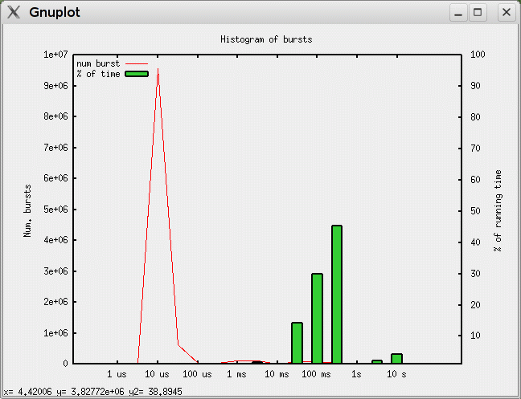

.. wxparaver documentation : 

.. _my_contents:

###############
Paraver Toolset
###############

.. contents::
    :depth: 3

.. sectnum:

Overview
########

*wxparaver* package comes with a small set of utilities to transform the trace files, to compute timelines or histograms or to get various statistics. These utilities, both scripts and binaries, are installed under the ``$PARAVER_HOME/bin`` directory.

The main utilities are:

* paramedir_ : integrates many functionalities, like to compute data from a *configuration.cfg* or to transform traces in various ways.

* prvmerger_ : merges two traces under some conditions.

* sort_ : detect unsorted traces, and sort them.

* stats_ : gather useful trace statistics.

Some of these utilities are integrated into *wxparaver* like the *paramedir* cut/filter options are in *Cut/Filter* window or like *stats* is in the *Run Application* window. Also, some scripts are intended to interconnect *wxparaver* with other BSC performance tools like *Dimemas* simulator.

.. :ref:`\<\< <my_contents>`

.. _paramedir:

paramedir
#########

*paramedir* packs two sets of features, some that process the trace to **compute some data** and some that **transform** the trace, usually to reduce its size.

The features used to **compute** are:

.. list-table::
  :widths: 18 6 6 6 6
  :header-rows: 1
  
  * - Feature
    - Config file
    - Many?
    - Output file
    - Loads Trace?
  * - Compute timeline
    - .cfg
    - Yes
    - .csv
    - Yes
  * - Compute Histogram
    - .cfg
    - Yes
    - .csv
    - Yes

After loading the trace and parsing the .cfg file, *paramedir* writes exactly the same CSV file that can be got from a *wxparaver* timeline or histogram after choosing *Save... --> Text* from their popup menus.

I.e.::

  $ paramedir linpack.prv useful.cfg -o my_result.csv
  /home/user/my_result.csv file written.

If no output name is explicitly given (`-o` parameter), the resulting CSV files are saved in the same directory where the .cfg is placed.

Also, it is possible to compute many .cfg in the same run::

  $ paramedir linpack.prv useful.cfg mpi_stats.cfg user_calls.cfg

The features used to transform the trace are:
    
    
    
+-------------------+--------------------------+--------+  
| Tool              | Files                    | Loads  |
|                   +--------+--------+--------+ trace? |
|                   | Config | Extra  | Output |        |
+-------------------+--------+--------+--------+--------+
| Cut               | .xml   | ---    | .prv   | no     |
+-------------------+--------+--------+--------+--------+
| Event-driven Cut  | .xml   | ---    | .prv   | no     |
+-------------------+--------+--------+--------+--------+
| Event translator  | ---    | .prv   | .prv   | no     |
+-------------------+--------+--------+--------+--------+
| Filter            | .xml   | ---    | .prv   | no     |
+-------------------+--------+--------+--------+--------+
| Software Counters | .xml   | ---    | .prv   | no     |
+-------------------+--------+--------+--------+--------+
| Time shift        | ---    | shifts | .prv   | no     |
+-------------------+--------+--------+--------+--------+

Most of the features that transform the trace need to read their parameters from the XML configuration file that can be saved from *wxparaver* (through Configuration File in *Cut & Filter* Window). There are some example files in ``$PARAVER_HOME/share/filters-config`` directory.

I.e.::

  $ paramedir -f linpack.prv filter-options.xml

The resulting trace is written in the same directory where the original trace was.

An interesting issue is that most of these operations can be combined in an unique command. So it's possible to pipeline some trace transformations in a sequential run. In this case, the flag order will express the sequence order in which they're executed.

I.e.::

  $ paramedir -f -c linpack.prv filter-options.xml

In the above example, the trace is filtered and then cut.

As expected, a .cfg (or many) can be added to a transformation command. Then, the trace fed to the compute phase will be allways the resulting trace of the transformation phase.

I.e.:: 

  $ paramedir -f -c linpack.prv filter-options.xml useful.cfg mpi_stats.cfg
  
In the above example, the trace *linpack.filter01.chop01.prv* will be used to compute the *Useful* timeline and the *MPI Stats* histogram.

As *wxparaver*, *paramedir* can also handle **gzipped** traces (.prv.gz).

Finally, note that *paramedir* have **no GUI**, so it's feasible to use it into jobs to be sent to non-graphical queues.

.. :ref:`\<\< <my_contents>`

Usage
*****
The command syntax is as follows::

  paramedir [-e] [-m] [-p] [-npr] <trace.prv> [ <config.cfg> | <config.cfg> <ouput-data-file> ]+

  
Process paraver trace (pipelined as flags are declared, using XML configuration parameters and without trace load)::

  paramedir [-c] [-f] [-s] [-o <output-file.prv>] <trace.prv> <options.xml>

Process paraver trace (direct parametrization, doesn't load trace)::

  paramedir [-g <event-type>] [-o <output-file>] <prv> 
  paramedir [-t <shift-times-file>] [-o <output-file>] <trace.prv> 

Process paraver trace (pipelined as flags are declared, using XML configuration parameters and without trace load)::

  paramedir [-c] [-f] [-s] [-o <output-file>] <trace.prv> <options.xml>

Process paraver trace (event_translator)::

  paramedir -et <reference_trace.prv> <source_trace.prv> [ -o <translated.prv> ] 

Compute numeric data from processed trace using histogram or timeline CFG's (all combined, trace is loaded)::

  paramedir [-e] [-m] [-p] [-c] [-f] [-s] [-o <output-file>] [-g <event-type>] \
            [-t <shift-times-file>] <trace.prv> [ <options.xml> ] [ <config.cfg> | <config.cfg> <ouput-data-file> ]+

.. :ref:`\<\< <my_contents>`

Options (General)
*****************

* .. option:: -h, --help

  Prints the Usage information (also printed when it's executed without parameters) 

  
* .. option:: -v, --version 

  Prints the program version

.. :ref:`\<\< <my_contents>`

.. _compute_histogram:

Options (compute histogram)
***************************

* .. option:: -npr, --no-preferences-precision
  
  Do not use the global precision (stated in the **wxparaver** *Preferences* window).

  
* .. option:: -m, --many-files

  Allows to separate an histogram cfg output (default: in a unique file).

* .. option:: -e, --empty-columns

  Hide empty columns of a histogram.                     

* .. option:: -p, --print-plane
  
  Only the selected Plane of a 3D histogram is saved (by default saves all planes).

.. :ref:`\<\< <my_contents>`

Options (other tools)
*********************

* .. option:: -o <trace_output.prv>, --output-name <trace_output.prv>
  
  Output trace name.  
  
* .. option:: -c, --cutter

  Apply Cutter tool.

* .. option:: -et <reference_trace>, --event-translator <reference_trace>

  Merge events using this reference trace for translations when conflicts found.

* .. option:: -f, --filter

  Apply Filter tool.

* .. option:: -g <event-type>, --event-cutter <event-type>

  Apply Event Driven Cutter using 'event-type' as mark.

* .. option:: -s, --software-counters

  Apply Software counters tool.

* .. option:: -t <shift-times-file>, --thread-shifter <shift-times-file>

  Apply Trace Shifter per thread (file contains at least as shift times as threads).

* .. option:: -tt <shift-times-file>, --task-shifter <shift-times-file>

  Apply Trace Shifter per task (file contains at least as shift times as tasks).                         

* .. option:: -ta <shift-times-file>, --app-shifter <shift-times-file>

  Apply Trace Shifter per applications (file contains at least as shift times as applications).                   

* .. option:: -tw <shift-times-file>, --workload-shifter <shift-times-file>

  Whole trace shift (file contains a unique shift time)

.. :ref:`\<\< <my_contents>`

Parameters
**********

* .. option:: trace.prv

  Paraver trace filename; can be gzipped (extensions allowed: only '.prv' or '.prv.gz' ).
  
* .. option:: options.xml

  Options for cutter/filter/software counters.
  

* .. option:: config.cfg

  Paraver configuration filename. If present, trace's loaded.
  
* .. option:: output-data-file

  Name given file with the computed data (used when some *config.cfg* is present). If this parameter is missing, *config.cfg* name is used, changing '.cfg' extension for '.mcr' ).

.. :ref:`\<\< <my_contents>`

Examples
********

Computes the *mpi_stats.cfg* analysis of compressed trace *linpack.prv*::

  $ paramedir linpack.prv.gz mpi_stats.cfg

Computes the *mpi_stats.cfg* and *total_MPI_activity.cfg* analysis of *linpack.prv*, saving first one in *my_data.txt* file::

  $ paramedir linpack.prv mpi_stats.cfg my_data.txt total_MPI_activity.cfg

Reads parameters of the cutter from the xml and applies them to *linpack.prv* trace::

  $ paramedir -c linpack.prv cutter.xml

Filters mpi calls of *linpack.prv*. Doesn't load it, just writes the file::

  $ paramedir --filter linpack.prv just_MPI_calls.xml

Reads parameters of the software counters, cutter and filter from the *cut_filter_options.xml* file and applies them pipelined in the given order ( 1.- software counters 2.- cutter, 3.- filter) to *linpack.prv* trace, and the filtered trace is loaded and used to compute *mpi_stats.cfg*. The computed mpi results are saved in *my_mpi_values.txt*::

  $ paramedir -s --cutter -f linpack.prv cut_filter_options.xml mpi_stats.cfg my_mpi_values.txt

Executes embeddend shifter utility::

  $ paramedir --thread-shifter shifttimes_per_thread.txt linpack.prv -o mylinpack.shifted.prv

.. :ref:`\<\< <my_contents>`

Drawbacks
*********

#) Disk space: transform utilities produce another trace as its result (no deletion of the original trace is done).

#) Memory usage: compute options let *paramedir* load the trace in memory as *wxparaver* does.

.. :ref:`\<\< <my_contents>`

.. _prvmerger:

prvmerger
#########

Merges or concatenates two traces that are in the same time unit and share the same objects and applications structure.

The header is taken from the first trace.

.. :ref:`\<\< <my_contents>`

Usage
*****
The command syntax is as follows::

  prvmerger < -[merge|concat] > < trace_in_1.prv > < trace_in_2.prv > < trace_out.prv > 

.. :ref:`\<\< <my_contents>`

Options
*******

* .. option:: -concat

  Concatenates the traces without checking if the resulting trace is sorted. It copies the header from the first one.

* .. option:: -merge

  Merges the traces, copying the header from the first one and sorting the records.

.. :ref:`\<\< <my_contents>`

Parameters
**********

* .. option:: trace_in_1.prv, trace_in_2.prv

  Traces to be merged.
  
* .. option:: trace_out.prv

  Output trace.

.. :ref:`\<\< <my_contents>`

Drawbacks
*********

#) No time unit translation is done.
#) If the resources or process hierarchy are different, then it may produce a trace semantically incoherent.

.. :ref:`\<\< <my_contents>`

.. _sort:

sort-trace.sh / is-trace-sorted.sh
##################################

A key aspect for most of the tools is to have the trace properly sorted by time. Since you can manipulate or generate your own traces, these scripts will help you sort them.

There are two simple scripts: **is-trace-sorted.sh** and **sort-trace.sh**. First one just complains if your trace is disordered, and the second one sorts it (without deleting the original one, and adding a *.sorted.prv* suffix to the resulting trace).

**is-trace-sorted.sh** stops immediately after the discovery of the first unsorted record.

In the case of **sort-trace.sh**, *stable sort* is applied: if two records have the same timestamp then they'll appear in the sorted trace with the same order they had in the original trace.

.. :ref:`\<\< <my_contents>`

Usage
*****

To just check trace order::

  is-trace-sorted.sh <trace_in>
  
To sort the trace::

  sort-trace.sh <trace_in>

If you execute them without parameters, you'll get a short usage message.

.. :ref:`\<\< <my_contents>`

Parameters
**********

* .. option:: trace_in

  Paraver tracefile. It can be an uncompressed (*.prv*) or a gzipped trace (*.prv.gz*).

.. :ref:`\<\< <my_contents>`

Drawbacks
*********

#) Disk space: both scripts decompress the trace if needed, and **sort-trace.sh** also rewrites the whole trace (no deletion of the original trace is done).
#) As expected, **is-trace-sorted.sh** will potentially read the whole trace if it's sorted.
#) Only gzip compression format is allowed.

.. :ref:`\<\< <my_contents>`

.. _stats:

stats
#####

**stats** is a tool that obtains some basic statistics from the trace. They are:

* Bursts histogram: only for computational bursts

* Events histogram

* Communications histogram

* Calls/thread histogram
    
The results are written to a *.dat* data file, and drawn into a *gnuplot* image.

They're written in the same directory where the input trace is.  It's possible to skip this gnuplot image generation. 

.. :ref:`\<\< <my_contents>`

Usage
*****

The command syntax is as follows::

  stats --help 

  stats < trace_input.prv > < options > 

.. :ref:`\<\< <my_contents>`

  
Parameters 
**********

* .. option:: trace_input.prv

  Should be an uncompressed Paraver tracefile and it has to appear before options.

.. :ref:`\<\< <my_contents>`

Options
*******

* .. option:: --help
  
  Display help information.

* .. option:: -bursts_histo

  Show bursts histogram. 

* .. option:: -events_histo[:[type1|type1-type2],...]

  Show events histogram, filtering types or ranges of types if needed. If no events are specified, all of them are counted.

* .. option:: -comms_histo

  Show comms histogram.

* .. option:: -thread_calls[:type1[-type2],...]

  Shows stats of the calls made by thread, filtering by type or ranges of types. This info is generated in file <trace_in>.calls.info. 

* .. option:: -exclusive_times

  Calculate exclusive times of routine calls instead inclusive times (to be used **only** with *-thread_calls*).

* .. option:: -o < file_name >

  Generate stats in file <file_name>.dat and  <file_name>.gnuplot (default are <trace_in>.dat and <trace_in>.gnuplot).
  
* .. option:: -only_dat_file

  Only generates the *dat* file (to be used **only** with *-o* flag, so it's named *file_name.dat*).
  

.. :ref:`\<\< <my_contents>`

Examples
********

For bursts histogram::

  $ stats trace_input.prv -bursts_histo 

  $ stats trace_input.prv -bursts_histo -o my_data -only_dat_file

For events histogram::

  $ stats trace_input.prv -events_histo

  $ stats trace_input.prv -events_histo:50000001,50000002

  $ stats trace_input.prv -events_histo:50000001-50000003,42000001-42000100

For communications histogram::

  $ stats trace_input.prv -comms_histo 

.. :ref:`\<\< <my_contents>`

Drawbacks
*********

#) Too much events will difficult the understanding of the gnuplot image. It's a good idea to shorten the list of events.

#) No compressed tracefiles are allowed.

.. :ref:`\<\< <my_contents>`

